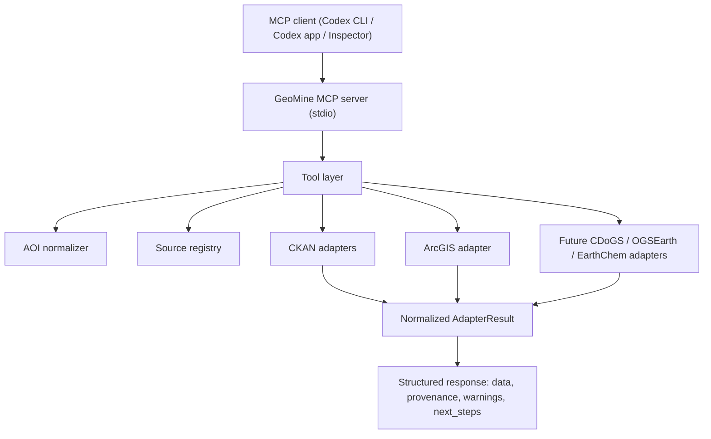

# Runnable MCP Server Build Guide

This guide describes how to turn GeoMine Research from a skill-only Codex plugin into a plugin that bundles a runnable MCP server. Execute it in phases. Do not add `.mcp.json` or `mcpServers` to `.codex-plugin/plugin.json` until the server starts, exposes tools, and passes contract tests.

## 1. Target Outcome

The first runnable server should be a local STDIO MCP server:

```text
Codex / MCP client
  -> starts scripts/geomine_mcp_server.py over stdio
  -> discovers GeoMine tools
  -> calls deterministic local tools first
  -> optionally calls bounded live adapters only when allow_network=true
```

Initial tools:

- `resolve_aoi`
- `search_geodata_sources`
- `search_mineral_occurrences`
- `fetch_geochem_metadata`
- `retrieve_assessment_reports`

The first merged version should expose real tools but keep live network optional. Live HTTP retrieval should be added only behind explicit flags.

## 2. Architecture



Keep these boundaries:

- `scripts/geomine_mcp_server.py`: MCP transport and tool registration only.
- `scripts/geomine/tools.py`: pure tool functions that can be tested without MCP.
- `scripts/geomine/adapters/`: source-specific URL builders, parsers, and future live clients.
- `tests/test_mcp_tools.py`: direct tests of pure tool functions.
- `tests/test_mcp_server_import.py`: verifies server import and basic registration readiness.

## 3. Dependencies

Use the official MCP Python SDK and FastMCP because the repository is already Python-based and the official SDK supports Python as a Tier 1 SDK.

Add dependencies to `pyproject.toml` when implementation begins:

```toml
[project]
dependencies = [
  "mcp[cli]>=1.2.0",
  "httpx>=0.28.0"
]

[project.scripts]
geomine-mcp = "geomine_mcp_server:main"
```

For local testing without permanently installing into the environment:

```bash
uv run --with "mcp[cli]" --with httpx python scripts/geomine_mcp_server.py
```

For pytest:

```bash
PYTHONPATH=scripts uv run --no-project --with pytest --with "mcp[cli]" --with httpx python -m pytest
```

## 4. Implement Pure Tool Functions First

Create `scripts/geomine/tools.py`. These functions should not import MCP. That keeps the business logic testable.

Recommended function shape:

```python
from __future__ import annotations

from typing import Any

from geomine.aoi import normalize_aoi


def resolve_aoi_tool(input_data: dict[str, Any]) -> dict[str, Any]:
    aoi = normalize_aoi(input_data)
    return {
        "data": aoi.as_dict(),
        "provenance": {
            "source": "local-normalizer",
            "retrieval_status": "parsed",
        },
        "warnings": aoi.warnings,
        "next_steps": [
            "Confirm authoritative geometry before distance, area, or buffer calculations."
        ],
    }
```

Tool function rules:

- Return `dict[str, Any]` only.
- Include `data`, `provenance`, `warnings`, and `next_steps`.
- Never write to stdout.
- Never call the network unless `allow_network=True`.
- If `allow_network=False`, return planned URLs and registry records, not fetched results.
- Preserve adapter names, versions, query parameters, and retrieval status.

## 5. Implement `search_geodata_sources`

Method:

1. Accept `query`, `jurisdiction`, `data_type`, `rows`, and `allow_network`.
2. If `allow_network=False`, return source registry matches, CKAN request URLs for Open Canada and BC Data Catalogue, and a warning that no live data was fetched.
3. If `allow_network=True`, use a bounded HTTP client with timeout and user agent.
4. Parse CKAN payloads with `OpenCanadaCkanAdapter` and `BcDataCatalogueAdapter`.
5. Normalize results to dictionaries via `AdapterResult.as_dict()`.

Pseudo-code:

```python
from geomine.adapters import BcDataCatalogueAdapter, OpenCanadaCkanAdapter, get_source_registry


def search_geodata_sources_tool(
    query: str,
    jurisdiction: str | None = None,
    data_type: str | None = None,
    rows: int = 10,
    allow_network: bool = False,
) -> dict[str, Any]:
    adapters = [OpenCanadaCkanAdapter()]
    if jurisdiction and jurisdiction.lower() in {"bc", "british columbia"}:
        adapters.append(BcDataCatalogueAdapter())

    planned = [
        {
            "adapter": adapter.name,
            "url": adapter.build_package_search_url(query, rows=rows),
        }
        for adapter in adapters
    ]

    if not allow_network:
        return {
            "data": {"planned_requests": planned, "registry": get_source_registry()},
            "provenance": {"retrieval_status": "planned"},
            "warnings": ["Network disabled; no live catalogue records fetched."],
            "next_steps": ["Run again with allow_network=true after confirming query scope."],
        }
```

## 6. Implement `search_mineral_occurrences`

Method:

1. Accept `jurisdiction`, `commodity`, `deposit_model`, `bbox`, `rows`, `allow_network`.
2. For British Columbia, use BC Data Catalogue query terms such as `MINFILE mineral occurrence`.
3. For US extension, build an ArcGIS REST query URL using `ArcGisFeatureServiceAdapter`; require bbox before spatial querying.
4. For Ontario, return OGSEarth/OMI roadmap records until a KML parser exists.
5. Return location-confidence warnings by default.

Response shape:

```json
{
  "data": {
    "planned_requests": [],
    "occurrences": []
  },
  "provenance": {
    "retrieval_status": "planned",
    "sources": ["BC Data Catalogue", "USGS MRData"]
  },
  "warnings": [
    "No occurrence proximity can be calculated until AOI CRS and geometry are confirmed."
  ],
  "next_steps": [
    "Retrieve source records and normalize MINFILE/OMI ids before model-fit interpretation."
  ]
}
```

## 7. Implement `fetch_geochem_metadata`

Method:

1. Accept `source`, `survey_id`, `source_url`, `jurisdiction`, `allow_network`.
2. In the first runnable server, return CDoGS, USGS, or provincial registry plans.
3. Do not parse analytical spreadsheets yet.
4. Add CDoGS HTML fixture parsing later for survey title, medium, files, KML URL, WMS layer, and analysis notes.
5. Return warnings for missing sample medium, analytical method, detection limits, and QA/QC.

## 8. Implement `retrieve_assessment_reports`

Method:

1. Accept `jurisdiction`, `project_name`, `report_id`, `nts_sheet`, `commodity`, `allow_network`.
2. In the first runnable server, return source plans for BC ARIS / Property File, Ontario Assessment File Database, and provincial/territorial systems.
3. Do not download PDF files by default.
4. Add live retrieval only after source terms, rate limits, and cache policy are implemented.

## 9. Create The MCP Server Entrypoint

Create `scripts/geomine_mcp_server.py`:

```python
from __future__ import annotations

from typing import Any

from mcp.server.fastmcp import FastMCP

from geomine.tools import (
    fetch_geochem_metadata_tool,
    resolve_aoi_tool,
    retrieve_assessment_reports_tool,
    search_geodata_sources_tool,
    search_mineral_occurrences_tool,
)

mcp = FastMCP("GeoMine Research")


@mcp.tool()
def resolve_aoi(input_data: dict[str, Any]) -> dict[str, Any]:
    """Normalize an AOI and report CRS, jurisdiction, assumptions, and warnings."""
    return resolve_aoi_tool(input_data)


@mcp.tool()
def search_geodata_sources(
    query: str,
    jurisdiction: str | None = None,
    data_type: str | None = None,
    rows: int = 10,
    allow_network: bool = False,
) -> dict[str, Any]:
    """Plan or perform bounded public geodata source search."""
    return search_geodata_sources_tool(query, jurisdiction, data_type, rows, allow_network)


@mcp.tool()
def search_mineral_occurrences(
    jurisdiction: str,
    commodity: str | None = None,
    deposit_model: str | None = None,
    bbox: dict[str, float] | None = None,
    rows: int = 10,
    allow_network: bool = False,
) -> dict[str, Any]:
    """Plan or perform bounded public mineral occurrence search."""
    return search_mineral_occurrences_tool(jurisdiction, commodity, deposit_model, bbox, rows, allow_network)


@mcp.tool()
def fetch_geochem_metadata(
    source: str | None = None,
    survey_id: str | None = None,
    source_url: str | None = None,
    jurisdiction: str | None = None,
    allow_network: bool = False,
) -> dict[str, Any]:
    """Plan or fetch geochemical survey metadata."""
    return fetch_geochem_metadata_tool(source, survey_id, source_url, jurisdiction, allow_network)


@mcp.tool()
def retrieve_assessment_reports(
    jurisdiction: str,
    project_name: str | None = None,
    report_id: str | None = None,
    nts_sheet: str | None = None,
    commodity: str | None = None,
    allow_network: bool = False,
) -> dict[str, Any]:
    """Plan or retrieve public assessment report metadata."""
    return retrieve_assessment_reports_tool(jurisdiction, project_name, report_id, nts_sheet, commodity, allow_network)


def main() -> None:
    mcp.run(transport="stdio")


if __name__ == "__main__":
    main()
```

Important STDIO rule: do not print logs to stdout. Use stderr or a logging handler that writes to stderr/files. stdout is reserved for JSON-RPC messages.

## 10. Add Tests

Create `tests/test_mcp_tools.py`:

```python
from geomine.tools import resolve_aoi_tool, search_geodata_sources_tool


def test_resolve_aoi_tool():
    result = resolve_aoi_tool({"name": "Example", "province": "Ontario"})
    assert result["data"]["province_or_territory"] == "Ontario"
    assert result["provenance"]["retrieval_status"] == "parsed"
    assert result["warnings"]


def test_search_geodata_sources_planned_mode():
    result = search_geodata_sources_tool("geochemistry", jurisdiction="BC", rows=5)
    assert result["provenance"]["retrieval_status"] == "planned"
    assert result["data"]["planned_requests"]
    assert "Network disabled" in " ".join(result["warnings"])
```

Create `tests/test_mcp_server_import.py`:

```python
import geomine_mcp_server


def test_server_imports():
    assert geomine_mcp_server.mcp.name == "GeoMine Research"
```

If direct access to registered tools changes in the SDK version, keep the import test minimal and rely on Inspector/Codex smoke tests for tool discovery.

## 11. Local Run Commands

Run directly:

```bash
PYTHONPATH=scripts uv run --with "mcp[cli]" --with httpx python scripts/geomine_mcp_server.py
```

This command starts a STDIO server and waits for an MCP client. It will appear idle in a normal terminal because it expects JSON-RPC messages over stdio. That is expected.

Use MCP Inspector:

```bash
npx @modelcontextprotocol/inspector \
  uv \
  --directory /Users/aibao/Documents/Project/MiningReg/openminer/plugins/Code/geo-mining-research \
  run \
  --with \
  "mcp[cli]" \
  --with \
  httpx \
  python \
  scripts/geomine_mcp_server.py
```

In Inspector:

1. Connect to the server.
2. Confirm the tool list contains all five GeoMine tools.
3. Call `resolve_aoi`.
4. Call `search_geodata_sources` with `allow_network=false`.
5. Verify response includes `data`, `provenance`, `warnings`, and `next_steps`.

## 12. Codex Local Configuration Before Plugin Bundling

Before bundling through the plugin manifest, test Codex MCP registration directly:

```bash
codex mcp add geomine-research \
  --env PYTHONPATH=/Users/aibao/Documents/Project/MiningReg/openminer/plugins/Code/geo-mining-research/scripts \
  -- \
  uv \
  --directory /Users/aibao/Documents/Project/MiningReg/openminer/plugins/Code/geo-mining-research \
  run \
  --with \
  "mcp[cli]" \
  --with \
  httpx \
  python \
  scripts/geomine_mcp_server.py
```

Then in Codex:

```text
/mcp
```

Verify the `geomine-research` server is active and the five tools are visible.

If startup fails:

- run the server command manually,
- check that `uv` is on PATH,
- use an absolute `uv` path if needed,
- confirm `PYTHONPATH` points to the plugin `scripts` directory,
- ensure no stdout logging occurs before MCP initialization.

## 13. Bundle The Server In The Plugin

Only after local server tests pass, create `.mcp.json` at plugin root:

```json
{
  "geomine-research": {
    "command": "uv",
    "args": [
      "--directory",
      ".",
      "run",
      "--with",
      "mcp[cli]",
      "--with",
      "httpx",
      "python",
      "scripts/geomine_mcp_server.py"
    ],
    "env": {
      "PYTHONPATH": "./scripts",
      "GEOMINE_ALLOW_NETWORK_DEFAULT": "false"
    },
    "startup_timeout_sec": 20,
    "tool_timeout_sec": 60,
    "enabled": true
  }
}
```

Then update `.codex-plugin/plugin.json`:

```json
"mcpServers": "./.mcp.json"
```

Validation changes:

- update `scripts/validate_plugin.py` to require `.mcp.json`;
- assert `plugin.json` includes `"mcpServers": "./.mcp.json"`;
- check `.mcp.json` has `geomine-research.command` and args.

## 14. Streamable HTTP Option For Later

Keep STDIO for local plugin bundling. Add Streamable HTTP only when deployment matters.

When needed:

1. Initialize server with `FastMCP("GeoMine Research", stateless_http=True, json_response=True)`.
2. Run with `mcp.run(transport="streamable-http")`.
3. Expose `http://localhost:8000/mcp` locally or a secured HTTPS endpoint remotely.
4. Configure Codex with:

```toml
[mcp_servers.geomine_research]
url = "https://your-domain.example/mcp"
bearer_token_env_var = "GEOMINE_MCP_TOKEN"
startup_timeout_sec = 20
tool_timeout_sec = 60
```

Use HTTP for production only after adding authentication, rate limits, cache controls, and request logging that avoids sensitive payloads.

## 15. Security And Compliance Rules

- Network calls are disabled by default.
- Any live retrieval must require `allow_network=true`.
- Bound `rows` and request timeouts.
- Do not download large files by default.
- Do not execute shell commands from tool inputs.
- Do not accept arbitrary URLs for fetching in v1; use allowlisted source adapters.
- Keep all logging off stdout for STDIO transport.
- Return research-assistance disclaimers for NI 43-101, resources/reserves, permitting, economics, or Indigenous consultation outputs.
- Preserve provenance in every tool result.

## 16. Acceptance Checklist

Implementation is ready to bundle only when:

- `python3 scripts/validate_plugin.py` passes.
- `PYTHONPATH=scripts uv run --no-project --with pytest --with "mcp[cli]" --with httpx python -m pytest` passes.
- `scripts/geomine_mcp_server.py` starts under MCP Inspector.
- Inspector lists all five tools.
- `resolve_aoi` returns structured output.
- `search_geodata_sources(..., allow_network=false)` returns planned requests, not fetched data.
- Direct `codex mcp add geomine-research ...` works.
- `.mcp.json` is added only after the above pass.
- `.codex-plugin/plugin.json` points to `.mcp.json` only after the server is runnable.

## 17. Suggested Implementation Order

1. Add `mcp[cli]` and `httpx` dependency notes.
2. Add `scripts/geomine/tools.py` with five pure tool functions.
3. Add `tests/test_mcp_tools.py`.
4. Add `scripts/geomine_mcp_server.py`.
5. Add `tests/test_mcp_server_import.py`.
6. Run pytest with MCP dependencies.
7. Test with MCP Inspector.
8. Test direct Codex MCP registration.
9. Add `.mcp.json`.
10. Update `plugin.json`.
11. Update validation.
12. Commit and push.

## References

- OpenAI Codex plugin structure and `.mcp.json` bundling: `https://developers.openai.com/codex/plugins/build`
- OpenAI Codex MCP configuration: `https://developers.openai.com/codex/mcp`
- MCP build-server guide: `https://modelcontextprotocol.io/docs/develop/build-server`
- MCP Python SDK list: `https://modelcontextprotocol.io/docs/sdk`
- MCP Python SDK repository: `https://github.com/modelcontextprotocol/python-sdk`
- MCP Inspector guide: `https://modelcontextprotocol.io/docs/tools/inspector`
