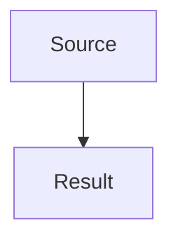

# GeoMine Paper PDF Export Skill

## Purpose

Use this skill when GeoMine Research produces a Markdown paper, technical report, literature review, or research memo and the user wants a PDF deliverable. It converts Markdown to a styled HTML intermediate and then to PDF while preserving formulas, physical units, chemical notation, Mermaid flowcharts, and Chinese text.

## When To Use

- After writing a GeoMine Research Markdown paper or report.
- When the report contains `$...$`, `$$...$$`, ` ```math ` fenced blocks, LaTeX commands, variables such as `rho_w`, `S_i^{rad}`, `dot{D}_w`, or units such as `mol m^{-3} s^{-1}`.
- When the report contains ` ```mermaid ` flowchart blocks that must become printable diagrams instead of code blocks.
- When the user asks for PDF, print-ready output, paper format, formula rendering, or Markdown formula repair.

## Workflow

1. Keep the Markdown file as the source of truth.
2. Prefer explicit Markdown math syntax:
   - inline: `$rho_w$`, `$S_i^{rad}$`, `$\dot{D}_w$`;
   - display: `$$ ... $$`;
   - GitHub-style fenced math is accepted and normalized.
3. Run the bundled exporter:

```bash
python3 skills/geomine-paper-pdf-export-skill/scripts/build_pdf_with_math.py \
  input.md \
  --output output.pdf \
  --title "Research title"
```

4. The exporter creates an HTML intermediate, converts math to MathML with Pandoc, and prints the result to PDF with headless Chrome.
5. After completing a paper, also generate the normalized-source PDF:
   - Search the relevant `report/` tree for `*.normalized.md`.
   - Render each normalized file to a matching PDF with the same stem, for example `paper.normalized.md` -> `paper.normalized.pdf`.
   - Keep both the regular paper PDF and the normalized-source PDF when both are present.
   - For batch conversion, run `python3 scripts/export_normalized_pdfs.py --root report`.
6. Mermaid fenced blocks are converted before Pandoc. The exporter uses local `mmdc` if available and otherwise uses the bundled flowchart SVG fallback for common `flowchart TB/LR` diagrams.
7. The exporter always writes an effective print CSS file that includes the GeoMine MathML layout guard and Mermaid SVG print guard. Even when a custom CSS file is supplied, inline formulas use `display: inline math` and display formulas use `display: block math`.
8. Verify that the HTML contains `<math>` tags, Mermaid `<svg>` figures, no `<pre class="math">` blocks, and `Unconverted mermaid code blocks: 0`. For sensitive reports, open or screenshot pages containing equations and diagrams before delivery.

## Formula Normalization

The exporter recognizes:

- fenced math blocks: ` ```math ... ``` `;
- existing `$...$`, `$$...$$`, `\(...\)`, and `\[...\]`;
- formula-like inline code spans such as `rho_w`, `S_i^{rad}`, `dot{D}_w`, `G_{H_2}^{(100eV)}`;
- common physical units such as `mol m^{-3} s^{-1}`, `kg m^{-3}`, `Gy s^{-1}`, `J kg^{-1} s^{-1}`;
- common Greek variable names written in ASCII, including `rho`, `alpha`, `epsilon`, `eta`, `Gamma`, `Delta`, and related variants.

The converter is intentionally conservative. If a phrase is ambiguous, write it explicitly as `$...$` in the Markdown source rather than relying on inference.

## Mermaid Rendering

The exporter recognizes fenced Mermaid blocks:

````markdown

````

Renderer options:

- default `--mermaid-renderer auto`: use local Mermaid CLI `mmdc` when installed; otherwise use the built-in SVG fallback;
- `--mermaid-renderer fallback`: force the built-in flowchart renderer;
- `--mermaid-renderer cli`: require `mmdc`;
- `--mermaid-renderer none`: preserve Mermaid fences as code.

The built-in fallback is designed for common `flowchart TB`, `TD`, `BT`, `LR`, and `RL` diagrams with bracket nodes and `-->`, `==>`, or `-.->` edges. For complex Mermaid syntax, install Mermaid CLI and use `--mermaid-renderer cli`.

## Output Rules

- Do not replace the Markdown source unless the user asks for source cleanup.
- Keep generated HTML and normalized Markdown as intermediates when debugging formula output.
- Every completed GeoMine paper should have a PDF generated from its `*.normalized.md` file as well as any primary paper PDF. The normalized PDF should be named `*.normalized.pdf`.
- Use `\mathrm{...}` for physical units and textual superscripts such as `rad`.
- Keep inline math inline. Do not use global `math { display: block; }`; use `math[display="inline"] { display: inline math; }` and `math[display="block"] { display: block math; }`.
- Mermaid diagrams must become printable SVG or Mermaid CLI output in the HTML intermediate. Do not leave report diagrams as raw code blocks unless the user explicitly asks for source-only output.
- Do not claim mathematical notation is correct without checking at least the HTML math-tag counts and a visual sample when formulas are central to the report.
